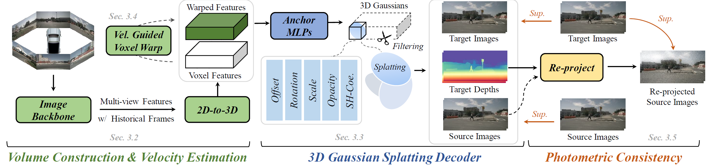

# VisionPAD: A Vision-Centric Pre-training Paradigm for Autonomous Driving

<p align="center">
    
</p>

This paper introduces VisionPAD, a novel self-supervised pre-training paradigm designed for vision-centric algorithms in autonomous driving. In contrast to previous approaches that employ neural rendering with explicit depth supervision, VisionPAD utilizes more efficient 3D Gaussian Splatting to reconstruct multi-view representations using only images as supervision. Specifically, we introduce a self-supervised method for voxel velocity estimation. By warping voxels to adjacent frames and supervising the rendered outputs, the model effectively learns motion cues in the sequential data. Furthermore, we adopt a multi-frame photometric consistency approach to enhance geometric perception. It projects adjacent frames to the current frame based on rendered depths and relative poses, boosting the 3D geometric representation through pure image supervision. Extensive experiments on autonomous driving datasets demonstrate that VisionPAD significantly improves performance in 3D object detection, occupancy prediction and map segmentation, surpassing state-of-the-art pre-training strategies by a considerable margin.


## Installation
This project is based on MMDetection3D, which can be constructed as follows:

```
conda create -n visionpad_py38 python=3.8.18 -y

conda activate visionpad_py38

pip install torch==1.11.0+cu113 torchvision==0.12.0+cu113 torchaudio==0.11.0 --extra-index-url https://download.pytorch.org/whl/cu113

pip install mmcv-full==1.5.0 -f https://download.openmmlab.com/mmcv/dist/cu113/torch1.11.0/index.html -i https://pypi.tuna.tsinghua.edu.cn/simple

pip install spconv-cu113 yapf==0.40.1 torch_efficient_distloss einops

pip install timm lyft_dataset_sdk networkx==2.2 numba==0.48.0 numpy==1.23.4 nuscenes-devkit plyfile scikit-image tensorboard trimesh==2.35.39 -i https://pypi.tuna.tsinghua.edu.cn/simple

pip install ninja mmdet==2.25.1 mmsegmentation==0.25.0 mmengine

pip install jaxtyping==0.2.19 e3nn==0.5.1

# install the smooth-sampler
pip install git+https://github.com/tymoteuszb/smooth-sampler

pip install torch-scatter -f https://data.pyg.org/whl/torch-1.11.0-cu113.html --no-cache-dir


pip install setuptools==59.5.0 yapf==0.40.1 einops


# for 3DGS rendering
git clone --recurse-submodules https://github.com/slothfulxtx/diff-gaussian-rasterization.git
cd diff-gaussian-rasterization
pip install -v .

## comple VisionPAD
cd VisionPAD
pip install -v -e .
```
## Data Preparation
Please follow the instruction of [UVTR](https://github.com/dvlab-research/UVTR) to prepare the dataset.

## Training & Testing
You can train the model following the instructions. You can also find the pretrained models [here](https://drive.google.com/drive/folders/1_D57qpLDbNAEAEqfjdNFDrlB5ntSDVrT?usp=sharing).
```bash
# pre-train (4 gpus)
bash tools/dist_train.sh <projects/path/of/pretrain_config.py> 4

# finetune (4 gpus)
bash tools/dist_train.sh <projects/path/of/finetune_config.py> 4

# test
bash ./extra_tools/dist_test.sh
```

Espcially, you can use the following command for reproducing the results of UniPAD-C without the LiDAR point cloud supervision in our Table 1 during the pre-training stage as:
```bash
## camera images inputs
bash tools/dist_train.sh projects/configs/unipad/uvtr_cam_vs0.075_pretrain_wo_depth.py 4

## camera sweeps images inputs
bash tools/dist_train.sh projects/configs/unipad/uvtr_cam_vs0.075_pretrain_wo_depth_cs3.py 4
```

## Results

### Main Results

| Name  | Input Modality | Pre-train Modality | NDS | mAP | Config | Log |
| ----- | -------------- | ------------------ | --- | --- | ------ | --- |
| UVTR+UniPAD | C      | C                | 44.8 | 38.5 | [pretrain](projects/configs/unipad/uvtr_cam_vs0.075_pretrain_wo_depth.py)/[finetune](projects/configs/unipad_final/final_uvtr_cam_vs0.075_finetune.py)     | [pretrain](logs/unipad_uvtr_cam_vs0.075_pretrain_wo_depth/20241103_212941.log)/[finetune](logs/unipad_finetune_uvtr_cam_vs0.075_wo_depth/20241104_115859.log)  |
| **UVTR+VisionPAD (Ours)** | C      | C                | 46.7 | 41.0 | [pretrain](projects/configs/visionpad/ours_cam_vs0.075_pretrain.py)/[finetune](projects/configs/unipad_final/final_uvtr_cam_vs0.075_finetune.py)     | [finetune](logs/ours_uvtr_cam_vs0.075_finetune/20241102_114548.log)  |
| UVTR+UniPAD Origin Setting | C          | C + L           | 47.4  | 41.5  | [pretrain](projects/configs/unipad/uvtr_cam_vs0.075_pretrain.py)/[finetune](projects/configs/unipad_final/final_uvtr_cam_vs0.075_finetune.py)    | -(Cite from UniPAD paper) |
| UVTR+UniPAD w/ CS3  | C          | C           | 48.6  | 40.5  | [pretrain](projects/configs/unipad/uvtr_cam_vs0.075_pretrain_wo_depth_cs3.py)/[finetune](projects/configs/unipad_final/final_uvtr_cam_vs0.075_finetune_cs3.py)    | [pretrain](logs/unipad_uvtr_cam_vs0.075_pretrain_wo_depth_cs3/20241112_114955.log)/[finetune](logs/unipad_finetune_uvtr_cam_vs0.075_cs3_wo_depth/20241113_084842.log) |
| **UVTR+VisionPAD (Ours) w/ CS3** | C          | C           | 49.7  | 41.2  | [pretrain](projects/configs/visionpad/ours_cam_vs0.075_pretrain_cs3.py)/[finetune](projects/configs/unipad_final/final_uvtr_cam_vs0.075_finetune_cs3.py)    | - |
| UVTR+UniPAD w/ CS3 Origin Setting  | C          | C + L           | 50.2  | 42.8  | [pretrain](projects/configs/unipad/uvtr_cam_vs0.075_pretrain_cs3.py)/[finetune](projects/configs/unipad_final/final_uvtr_cam_vs0.075_finetune_cs3.py)    | -(Cite from UniPAD paper) |
| **UVTR+VisionPAD (Ours) w/ CS3** | C          | C + L           | 50.4  | 43.1  | [pretrain](projects/configs/visionpad/ours_cam_vs0.075_pretrain_cs3_w_gt_depth.py)/[finetune](projects/configs/unipad_final/final_uvtr_cam_vs0.075_finetune_cs3.py)    | - |


CS3 means using historical 3 camera sweeps as inputs.

## Acknowledgement
This project is mainly based on the following codebases. Thanks for their great works!

- [UniPAD](https://github.com/Nightmare-n/UniPAD)
- [UVTR](https://github.com/dvlab-research/UVTR)
- [MMDetection3D](https://github.com/open-mmlab/mmdetection3d)
